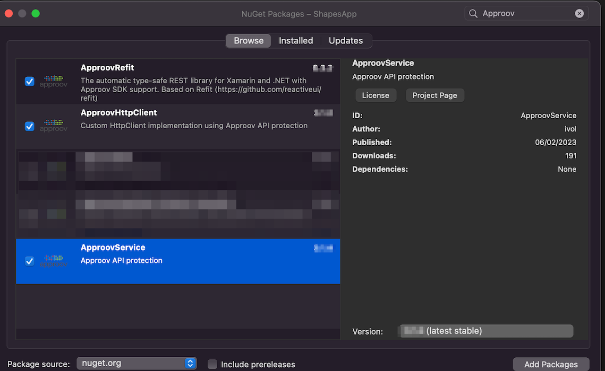

# APPROOV QUICKSTART: MAUI REFIT

This quickstart is written specifically for mobile iOS and Android apps that are written in C# and .NET for making the API calls that you wish to protect with Approov. The sample code shown in this guide makes use of a custom [Refit](https://github.com/reactiveui/refit) implementation, ApproovRefit in order to access network resources. If this is not your situation then check if there is a more relevant quickstart guide available.

This quickstart provides the basic steps for integrating Approov into your app. A more detailed step-by-step guide using a [Shapes App Example](https://github.com/approov/quickstart-maui-refit/blob/master/SHAPES-EXAMPLE.md) is also available.

To follow this guide you should have received an onboarding email for a trial or paid Approov account.

Note that the minimum OS requirement for iOS is 11 and for Android the minimum SDK version is 21 (Android 5.0). You cannot use Approov in apps that need to support OS versions older than this.
We will use the latest versions of the `nuget.org` packages, `ApproovService.3.1.4`, `ApproovHttpClient.3.1.0` and `ApproovRefit.6.3.2`.


## ADDING THE APPROOV SDK ENABLED REFIT PACKAGE

The Approov SDK needs a slightly modified `Refit` package using a specific implementation, and it is  available as a NuGet package in the default repository `nuget.org`. Note that it is not possible to use `Refit` and the `ApproovRefit` packages in the same project so you will need to uninstall the `Refit` package and replace it with the modified `ApproovRefit` one. Select and install the latest available version. Repeat the previous steps for the `ApproovHttpClient` and the `ApproovService` packages.



## OKHTTP PACKAGE

The `ApproovService` Android native implementation makes use of [OkHttp](https://square.github.io/okhttp/) library and it requires its inclusion in any project targetting Android. The package `Square.OkHttp3-4.9.3` from nuget.org is compatible with the latest version of the `ApproovService` package.


## USING THE APPROOV SERVICE

 Before using the `ApproovService` class, you need to initialize it with a configuration string. This will have been provided in your Approov onboarding email (it will be something like `#123456#K/XPlLtfcwnWkzv99Wj5VmAxo4CrU267J1KlQyoz8Qo=`). After initializing the `ApproovService` class, you can obtain an `ApproovHttpClient` and perform network requests:

```C#           
ApproovService.Initialize("<enter-your-config-string-here>");
ApproovHttpClient httpClient = ApproovService.CreateHttpClient(); 
try
{
    apiClient = RestService.For<IApiInterface>(httpClient);
}
catch (Exception ex)
......
```

Please, do note that you MUST explicitly create an `ApproovHttpClient` and pass this as parameter to `ApproovRefit` otherwise a default `HttpClient` will be used that has not been configured and network request will not succeed. The `ApproovHttpClient` implementation and its subclasses mimic the original `HttpClient` behaviour but with an additional call to the Approov servers. If you would like to use a custom `HttpMessageHandler` instead of a default one generated by `ApproovHttpClient` you can configure it and pass it as parameter like so:

```C#
ApproovHttpClient httpClient = ApproovService.CreateHttpClient(HttpMessageHandler handler)            
```

Errors will generate an `ApproovException` which is a subclass of `Exception` and includes a descriptive error message and boolean value suggesting whether if the last operation should be attempted again. The `ApproovException` class is further subclassed by `InitializationFailureException` indicating an initialization error, `ConfigurationFailureException` in the case of the Approov SDK being incorrectly configured, `PinningErrorException` if a pinning mismatch occurs, a networking exception is represented by `NetworkingErrorException`. A `PermanentException` indicates an unrecoverable error and a `RejectionException` indicates the current device has had a rejected message sent by the Approov server; in this case, further information is provided in the `ARC` and `RejectionReasons` fields, as long as it has been [enabled](https://approov.io/docs/latest/approov-cli-tool-reference/#policy-command).

## ANDROID MANIFEST CHANGES
The following app permissions need to be available in the manifest to use Approov:

```xml
<uses-permission android:name="android.permission.ACCESS_NETWORK_STATE" />
<uses-permission android:name="android.permission.INTERNET" />
```

Please [read this](https://approov.io/docs/latest/approov-usage-documentation/#targetting-android-11-and-above) section of the reference documentation if targetting Android 11 (API level 30) or above.

## CHECKING IT WORKS

Initially you won't have set which API domains to protect, so the interceptor will not do anything. It will have called Approov though and made contact with the Approov cloud service. You will see logging from Approov saying `UNKNOWN_URL`.

Your Approov onboarding email should contain a link allowing you to access [Live Metrics Graphs](https://approov.io/docs/latest/approov-usage-documentation/#metrics-graphs). After you've run your app with Approov integration you should be able to see the results in the live metrics within a minute or so. At this stage you could even release your app to get details of your app population and the attributes of the devices they are running upon.

## NEXT STEPS
To actually protect your APIs there are some further steps. Approov provides two different options for protection:

* [API PROTECTION](https://github.com/approov/quickstart-maui-refit/blob/master/API-PROTECTION.md): You should use this if you control the backend API(s) being protected and are able to modify them to ensure that a valid Approov token is being passed by the app. An [Approov Token](https://approov.io/docs/latest/approov-usage-documentation/#approov-tokens) is short lived crytographically signed JWT proving the authenticity of the call.

* [SECRETS PROTECTION](https://github.com/approov/quickstart-maui-refit/blob/master/SECRETS-PROTECTION.md): If you do not control the backend API(s) being protected, and are therefore unable to modify it to check Approov tokens, you can use this approach instead. It allows app secrets, and API keys, to be protected so that they no longer need to be included in the built code and are only made available to passing apps at runtime.

Note that it is possible to use both approaches side-by-side in the same app, in case your app uses a mixture of 1st and 3rd party APIs.

See [REFERENCE](https://github.com/approov/quickstart-maui-refit/blob/master/REFERENCE.md) for a complete list of all of the `ApproovService` methods.
