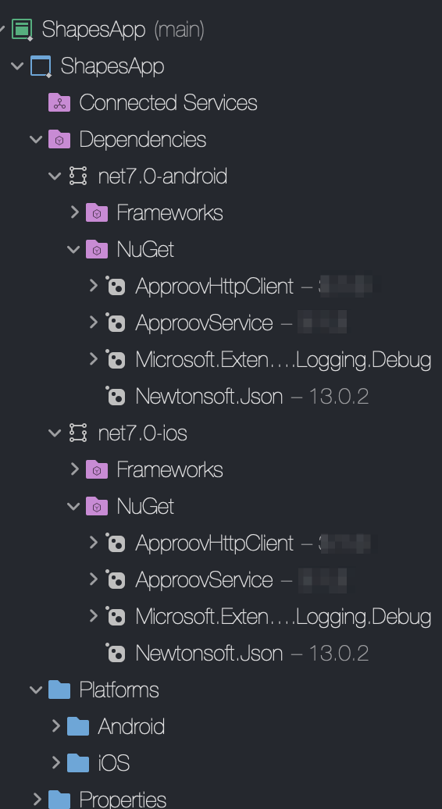
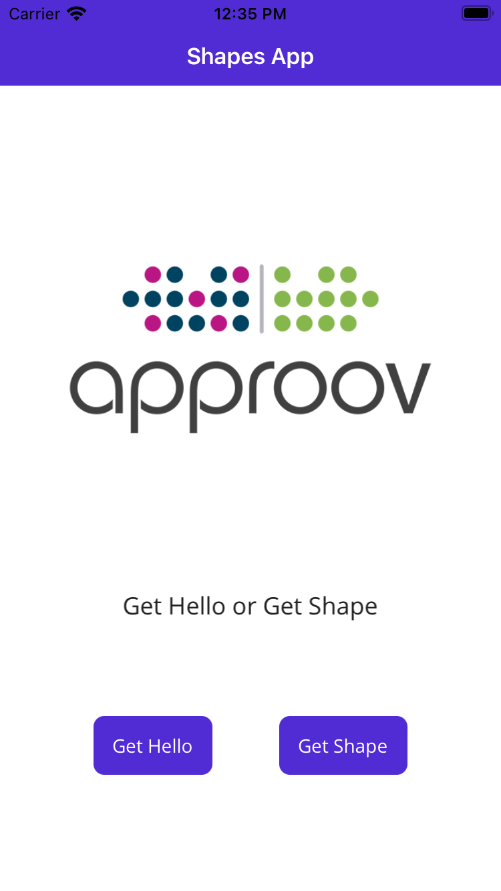
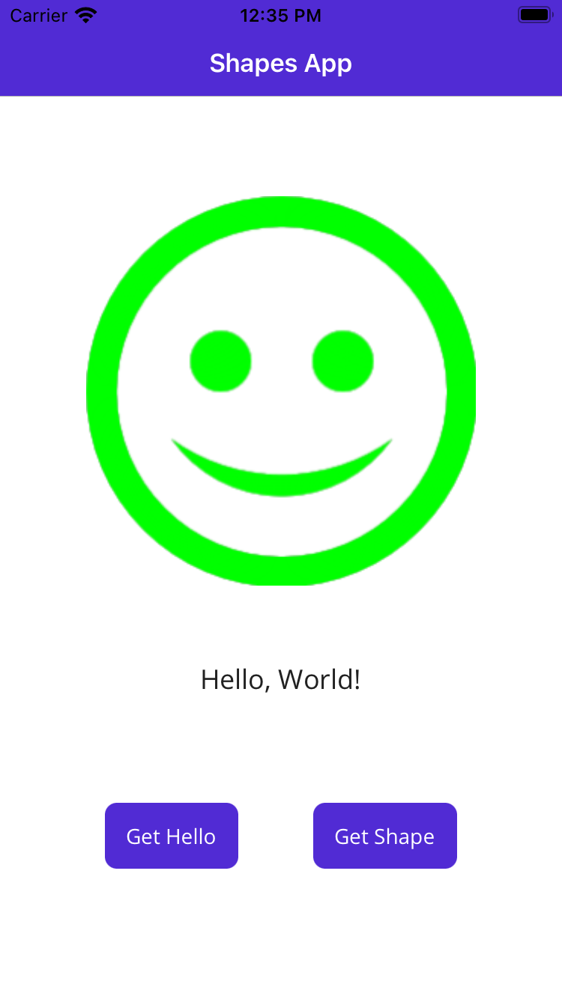
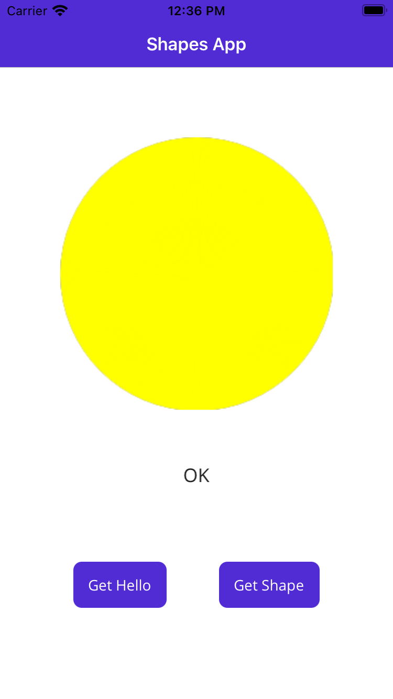
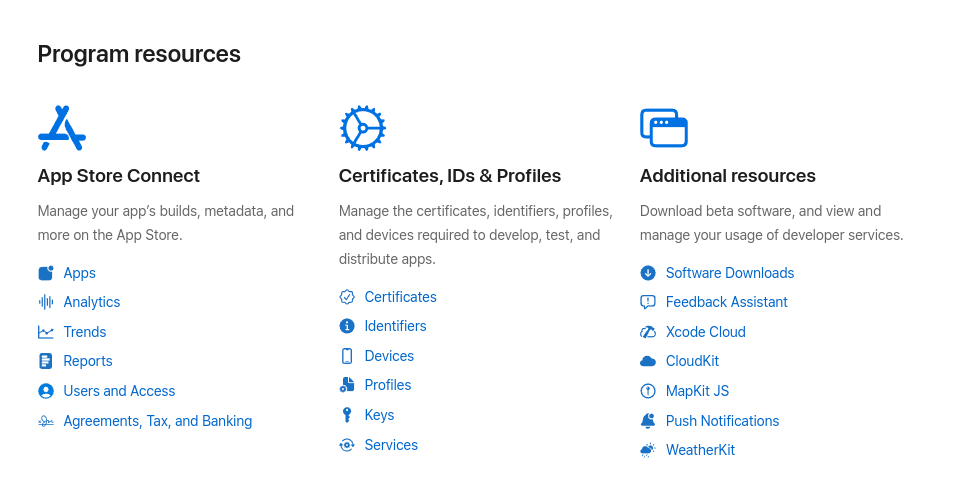
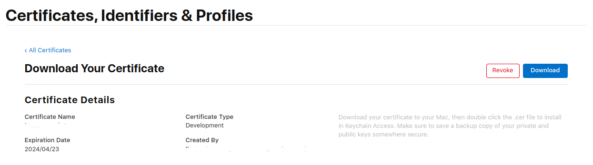
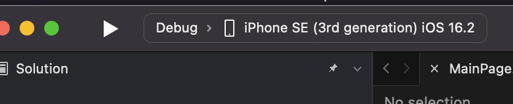
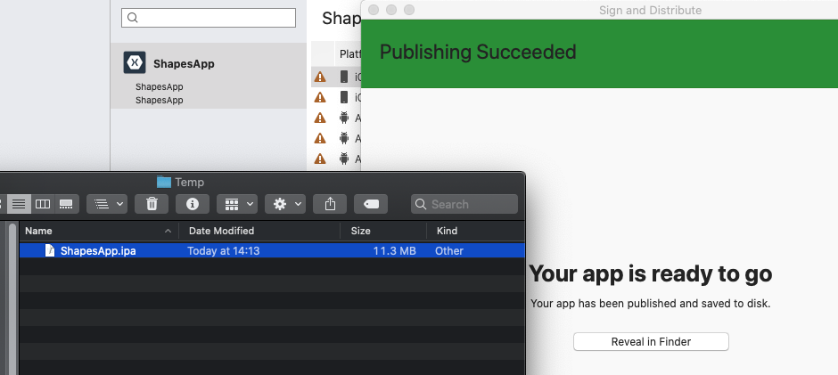
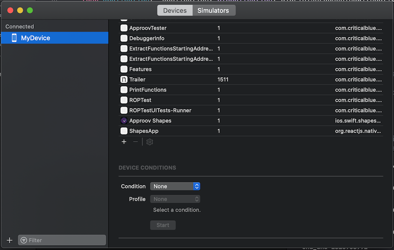

# SHAPES EXAMPLE

This quickstart walks you, step by step, through protecting a real app with Approov. It is written for iOS and Android apps built with **.NET MAUI** that make API calls using [`HttpClient`](https://learn.microsoft.com/en-us/dotnet/api/system.net.http.httpclient) through [Refit](https://github.com/reactiveui/refit), an automatic type-safe REST library. You will start from a plain, unprotected app and add Approov to it one small change at a time. The example uses .NET 9.

If you just want the integration steps for your own app rather than this tutorial, see the [README](README.md) instead.

## WHAT YOU WILL NEED
* Access to a trial or paid Approov account
* The `approov` command line tool [installed](https://approov.io/docs/latest/approov-installation/) with access to your account
* [Visual Studio 2022 (Windows) or Rider (Mac)](https://visualstudio.microsoft.com/)
* A Mac with a recent version of Xcode, accessed from Visual Studio using `Pair To Mac`, if you are building the iOS app
* The contents of this repository
* An Apple mobile device with iOS 15+ or an Android 6.0+ device. An iOS simulator or Android emulator will also work
* The [approov-service-net-httpclient](https://github.com/approov/approov-service-net-httpclient) repository, cloned alongside this one (see [ADD THE APPROOV SERVICE LAYER](#add-the-approov-service-layer))

## HOW THIS QUICKSTART WORKS

The whole tutorial is driven by editing a **single file**, [`MainPage.xaml.cs`](ShapesApp/MainPage.xaml.cs). To keep things easy to follow, that file is already laid out as a series of **stages**, each marked with a `STAGE` comment. You move forward simply by changing one setting and commenting/uncommenting the lines for the next stage:

| Stage | Endpoint | What it demonstrates |
| ----- | -------- | -------------------- |
| **Stage 1** | `v1` | The starting point — a plain `HttpClient`, driven by a Refit interface, with an API key hard-coded into the app. No Approov. |
| **Stage 2** | `v3` | **API protection** — `ApproovHttpClient` adds a verified Approov token to every request. |
| **Stage 3** | `v5` | Adds an **HTTP message signature** as a second, independent proof on top of the token. |

The endpoint version is controlled by a single `ENDPOINT_VERSION` constant that is baked into the base URL. The Refit interface paths (`/hello/`, `/shapes/`) therefore never change as you move between stages.

There is also a **Secrets Protection** section at the end. This is an *alternative* to Stages 2–3 for when you cannot change the backend: instead of checking a token server-side, Approov keeps your API key out of the app and only hands it to genuine app instances at runtime.

Work through the sections in order. Each one tells you exactly which lines to change and ends with a short note on what you just achieved.

## ADD THE APPROOV SERVICE LAYER

Complete this setup before the first build, including Stage 1: the project references the service layer even while its runtime integration is commented out.

The Approov integration is provided by the [approov-service-net-httpclient](https://github.com/approov/approov-service-net-httpclient) repository. Clone it as a sibling of this quickstart repository and check out the tag that this guide uses (`3.5.5`):

```
git clone https://github.com/approov/approov-service-net-httpclient.git
cd approov-service-net-httpclient
git checkout 3.5.5
```

The `ShapesApp` project already contains the required `ProjectReference`, which expects the service layer repository to be located alongside this one:

```xml
<ProjectReference Include="..\..\approov-service-net-httpclient\ApproovService.MAUI\ApproovService.MAUI.csproj" />
```

This service layer is an open source wrapper that lets you use Approov with `HttpClient`. The native Approov SDKs are **not bundled**. Complete the [native SDK download steps](README.md#obtain-the-native-sdks-before-building) for the platforms you intend to build, using SDK `3.5.3` and the exact paths shown there. The wrapper works alongside the existing `Refit` package and declares its own Android dependencies; no Approov-specific Refit package is required.

Your project structure should now look like this:



## RUNNING THE SHAPES APP WITHOUT APPROOV

> **This is Stage 1.** The app is unprotected — we run it first so you can see the starting point before Approov is added.

Open the `ShapesApp.sln` solution in the `ShapesApp` folder using `File->Open` in Visual Studio. The application targets both iOS and Android. This guide targets iOS; the Android app differs only in codesigning and in generating `.ipa` or `.apk` files. The source code is shared between platforms in the common file `MainPage.xaml.cs`, so the edits below apply to both. Choose your platform with the Build target in Visual Studio.

If running the iOS application, select the `Info.plist` file and change the Bundle Identifier to contain a unique string (e.g. your company name), since Apple will reject the default one. Select the appropriate device/simulator target and run the ShapesApp application.

Once the application is running you will see two buttons:

<p>
    
</p>

Press the `Get Hello` button and you should see this:

<p>
    
</p>

This checks connectivity by calling `https://shapes.approov.io/v1/hello`. Now press the `Get Shape` button and you will see this:

<p>
    
</p>

This calls `https://shapes.approov.io/v1/shapes` to get the name of a random shape. It succeeds (HTTP status `200`) because this endpoint is protected only by an API key that is hard-coded into the app — and which could therefore be extracted from the app by an attacker.

*What just happened:* the app works, but its API key is exposed. Over the next stages you will add Approov so the backend can be sure requests come from a genuine, untampered instance of your app.

## ENSURE THE SHAPES API IS PROTECTED

For Approov tokens to be generated for `shapes.approov.io` you must first tell Approov about the domain:

```
approov api -add shapes.approov.io
```

Tokens for this domain are automatically signed with the specific secret for the domain, rather than the normal one for your account.

## MODIFY THE APP TO USE APPROOV

> **This is Stage 2 (endpoint `v3`).** The app will now send a verified Approov token alongside the API key.

Every change here is in `MainPage.xaml.cs`, guided by the `STAGE` comments already in the file. Make the following five edits. Note that the Refit `IApiInterface` at the bottom of the file does **not** need to change — the endpoint version is set once via `ENDPOINT_VERSION`.

**1. Switch the endpoint to `v3`** — the endpoint that checks the Approov token (as well as the API key):

```C#
const string ENDPOINT_VERSION = "v3";
```

**2. Add your Approov configuration string.** The SDK needs this to identify your account. It was included in your Approov onboarding email (something like `#123456#K/XPlLtfcwnWkzv99Wj5VmAxo4CrU267J1KlQyoz8Qo=`). Replace the placeholder:

```C#
const string APPROOV_CONFIG = "<enter-your-config-string-here>";
```

**3. Enable the Approov service layer** by uncommenting the `using Approov;` directive near the top of the file:

```C#
using Approov;
```

**4. Use `ApproovHttpClient` instead of `HttpClient`.** Comment out the Stage 1 field declaration and uncomment the Stage 2 one:

```C#
//private static HttpClient httpClient;
private static ApproovHttpClient httpClient;
```

**5. Initialize Approov, disable signing for this stage and create the client.** In the constructor, comment out the Stage 1 line and uncomment the three Stage 2 lines:

```C#
// STAGE 1 — comment this out
//httpClient = new HttpClient();

// STAGE 2 — uncomment these
ApproovService.Initialize(APPROOV_CONFIG);
ApproovService.SetServiceMutator(ApproovServiceMutatorDefault.Shared);
httpClient = new ApproovHttpClient();
```

The pinned service layer attempts message signing by default. `ApproovServiceMutatorDefault.Shared` explicitly selects the base mutator without signing, so Stage 2 demonstrates token-only protection. Keep this line in place when moving to Stage 3; the later signer registration will replace it. Reapply custom configuration after initialization, which resets the service mutator.

`ApproovHttpClient` is a drop-in replacement for `HttpClient`, so it is passed to `RestService.For<IApiInterface>(httpClient)` exactly as before. It automatically adds the `Approov-Token` header and applies TLS certificate pinning to protected requests.

*What just happened:* the app is now wired up to fetch and send Approov tokens. Before it can pass attestation on a real device, Approov needs to recognize the certificate you sign the app with — that is the next step.

## ADD YOUR SIGNING CERTIFICATE TO APPROOV

You must add the signing certificate used to sign your apps so that Approov can recognize your app as being official.

Codesigning must also be enabled. If you need assistance, see [Microsoft's codesigning support](https://docs.microsoft.com/en-us/xamarin/ios/deploy-test/provisioning/) or [Android deploy signing](https://docs.microsoft.com/en-us/xamarin/android/deploy-test/signing/?tabs=macos).

### Android
Add the local certificate used to sign apps in Android Studio. The following assumes it is in PKCS12 format:

```
approov appsigncert -add ~/.android/debug.keystore -storePassword android -autoReg
```

Note: on Windows, substitute `\` for `/` in the command above and use the full path to your user home directory instead of `~`.

See [Android App Signing Certificates](https://approov.io/docs/latest/approov-usage-documentation/#android-app-signing-certificates) if your keystore format is not recognized or if you have any issues adding the certificate. That page also covers certificates for releasing to the Play Store. Note that you must also apply specific [Android Obfuscation](https://approov.io/docs/latest/approov-usage-documentation/#android-obfuscation) rules when creating an app release.

### iOS
Your certificates are available in your Apple development account portal. Go to the initial screen showing program resources:



Click on `Certificates` and you will be presented with the full list of development and distribution certificates for the account. Click on the certificate being used to sign applications from your Xcode installation and you will be presented with the following dialog:



Click on the `Download` button, and a file with a `.cer` extension is downloaded, e.g. `development.cer`. Add it to Approov with:

```
approov appsigncert -add development.cer -autoReg
```

If you cannot download the correct certificate from the portal, it is also possible to [add app signing certificates from the app](https://approov.io/docs/latest/approov-usage-documentation/#adding-apple-app-signing-certificates-from-app).

> **IMPORTANT:** Apps built to run on the iOS simulator are not code signed, so auto-registration does not work for them. In that case you can [force a device ID to pass](https://approov.io/docs/latest/approov-usage-documentation/#forcing-a-device-id-to-pass) to get a valid attestation.

## RUNNING THE SHAPES APP WITH APPROOV

Make sure you have selected the correct build mode (Release) and target device (Generic Device) settings.



Select the `Build` menu and then `Publish`. Once the archive file is ready, sign it (`Ad Hoc`, `Enterprise` or `Play Store` depending on the platform) and save it to disk.



Install the `ApproovShapes.ipa` or `.apk` file on the device. Remove the old app from the device first.

If using a recent macOS version (later than Catalina) and targeting iOS, simply drag the `.ipa` file onto the device. Alternatively, in `Xcode` select `Window`, then `Devices and Simulators`, and after selecting your device click the small `+` sign to locate the `.ipa` archive to install. For Android you will need to use the command line tools provided by Google.



Launch the app and press the `Get Shape` button. You should now see a shape (or another shape):

<p>
    
</p>

*What just happened:* the app fetched a validly signed Approov token and presented it to the `v3/shapes` endpoint, which accepted it. Your API is now protected by Approov. If instead you do not get a shape, see the troubleshooting steps below.

## WHAT IF I DON'T GET SHAPES

If you don't get a valid shape, there are a few things to check. Remember this may be because the device you are using has characteristics that cause rejection under the [Security Policy](https://approov.io/docs/latest/approov-usage-documentation/#security-policies) currently set on your account:

* Ensure that the version of the app you are running is signed with the correct certificate.
* Look at the [`syslog`](https://developer.apple.com/documentation/os/logging) output from the device. Information about any Approov token fetched, or an error, is printed — e.g. `Approov: Approov token for host: https://approov.io : {"anno":["debug","allow-debug"],"did":"/Ja+kMUIrmd0wc+qECR0rQ==","exp":1589484841,"ip":"2a01:4b00:f42d:2200:e16f:f767:bc0a:a73c","sip":"YM8iTv"}`. You can easily [check](https://approov.io/docs/latest/approov-usage-documentation/#loggable-tokens) its validity.
* Use `approov metrics` to see [Live Metrics](https://approov.io/docs/latest/approov-usage-documentation/#metrics-graphs) of the cause of failure.
* You can use a debugger or emulator/simulator and get valid Approov tokens on a specific device by [forcing a device ID to pass](https://approov.io/docs/latest/approov-usage-documentation/#forcing-a-device-id-to-pass). As a shortcut, you can use `latest` so that the `device ID` doesn't need to be extracted from the logs or an Approov token.
* You can also use a debugger or Android emulator and get valid Approov tokens on any device if you [mark the signing certificate as being for development](https://approov.io/docs/latest/approov-usage-documentation/#development-app-signing-certificates). To attest on such a device, obtain a development key with `approov devkey -create` and register it in the app by uncommenting `ApproovService.SetDevKey("<your-dev-key>");` in the constructor.
* For more detail while debugging, enable verbose Approov logging by uncommenting `ApproovService.SetLoggingLevel(ApproovLogLevel.Debug);` in the constructor.

## SHAPES APP WITH MESSAGE SIGNING (v5)

> **This is Stage 3 (endpoint `v5`).** It builds directly on the Stage 2 changes you just made.

Message signing adds a second, independent proof to each request: on top of the Approov token, the app attaches an [RFC 9421](https://www.rfc-editor.org/rfc/rfc9421) HTTP message signature (`Signature` / `Signature-Input` headers) that the backend verifies. The `v5/shapes` endpoint requires the API key **and** a valid Approov token **and** a valid message signature.

Apply the following edits in `MainPage.xaml.cs`:

**1. Change the endpoint version:**

```C#
const string ENDPOINT_VERSION = "v5";
```

**2. Uncomment the message-signing namespace** at the top of the file:

```C#
using Approov.Util.Sig;
```

**3. Register the message signer** in the constructor, right after creating the `ApproovHttpClient`. Uncomment all three lines in the Stage 3 registration block. This replaces the base mutator selected in Stage 2:

```C#
ApproovService.SetServiceMutator(
    new ApproovDefaultMessageSigning().SetDefaultFactory(
        ApproovDefaultMessageSigning.GenerateDefaultSignatureParametersFactory()));
```

The factory uses **installation message signing** (`ecdsa-p256-sha256`) over `@method`, `@target-uri`, the Approov token and trace-ID headers, plus optional `Authorization`, `Content-Length` and `Content-Type` headers when present. It includes `created` and a 15-second `expires` lifetime. See [USAGE](https://github.com/approov/approov-service-net-httpclient/blob/3.5.5/USAGE.md#http-message-signing) for body-digest behavior, custom covered components and account signing.

**4. Enable installation public-key inclusion for your Approov account** so the backend can verify the signature:

```
approov policy -setInstallPubKey on
```

This account-wide policy change requires an `admin` role and CLI confirmation. It includes the installation public key in the token's `ipk` claim; it is not a per-domain switch. See [installation-signing setup](https://approov.io/docs/latest/approov-usage-documentation/#enabling-installation-message-signing) for details. Check the setting with `approov policy -getInstallPubKey`, then rebuild and run.

**iOS simulator.** The `ShapesApp` project includes `Platforms/iOS/Entitlements.plist`, which gives the app a keychain access group (`$(AppIdentifierPrefix)$(CFBundleIdentifier)`). The Approov SDK stores its installation key in the keychain. Without this entitlement, the simulator rejects the key (`errSecMissingEntitlement`, `-34018`). The request then goes out without a signature, and the service layer logs `message signing failed; proceeding unsigned`. If you add installation message signing to your own app, add the same entitlement and set `CodesignEntitlements` for iOS, as `ShapesApp.csproj` does.

Press the `Get Shape` button. A shape with an `OK` status means the API key, the Approov token **and** the message signature were all accepted by `v5/shapes`.

### Verify that an unsigned request is rejected

Keep `ENDPOINT_VERSION = "v5"`, the API key, your Approov configuration and the account policy unchanged. Comment out all three lines of the Stage 3 signer registration. Keep the Stage 2 line below active, after `Initialize`:

```C#
ApproovService.SetServiceMutator(ApproovServiceMutatorDefault.Shared);
```

Rebuild, restart the app and press `Get Shape`. The request still carries an Approov token, but has no message signature, so `v5/shapes` should reject it. Record the actual response status; an HTTP `200` means the negative control has not demonstrated signature enforcement.

Uncomment the Stage 3 registration again, rebuild and restart. Confirm that the signed request succeeds. Simply removing a custom signer without selecting the base mutator, or passing `null` to `SetServiceMutator`, restores default signing and does not create an unsigned control.

## SHAPES APP WITH SECRETS PROTECTION

This section illustrates an alternative option for Approov protection when you are **not able to modify the backend** to add an Approov token check. Instead of verifying a token server-side, Approov protects the API key itself: the key is removed from the app and delivered at runtime only to app instances that pass attestation. This substantially improves your protection and prevents the key being abused if it is extracted from the app.

The steps below are a worked example for the Shapes app. See [SECRETS PROTECTION](SECRETS-PROTECTION.md) for the full set of options (query-parameter substitution, fetching secrets explicitly, handling rejections and more).

This continues from the Approov integration you added in [MODIFY THE APP TO USE APPROOV](#modify-the-app-to-use-approov). Keep `ApproovService.Initialize(...)` and `new ApproovHttpClient()` in place — secret substitution only works over the Approov networking stack. The `shapes.approov.io` domain you already added with `approov api -add` is reused here.

**1. Point back at the API-key-only endpoint.** The `v1/shapes` endpoint checks only the API key (no Approov token), so set the endpoint version back to `v1` in `MainPage.xaml.cs`:

```C#
const string ENDPOINT_VERSION = "v1";
```

**2. Remove the real API key from the app.** Replace the hard-coded key with a placeholder value, so the shipped app no longer contains the secret:

```C#
// before
const string SHAPES_API_KEY = "yXClypapWNHIifHUWmBIyPFAm";
// after
const string SHAPES_API_KEY = "shapes_api_key_placeholder";
```

**3. Register the real secret with Approov.** Tell Approov to map the placeholder to the real API key. Approov will deliver the real value only to apps that pass attestation:

```
approov secstrings -addKey shapes_api_key_placeholder -predefinedValue yXClypapWNHIifHUWmBIyPFAm
```

> Note that this command requires an [admin role](https://approov.io/docs/latest/approov-usage-documentation/#account-access-roles).

**4. Enable header substitution in the app.** Tell the `ApproovService` that the `Api-Key` header is subject to substitution. Uncomment this line in the constructor (it appears just below the STAGE blocks):

```C#
ApproovService.AddSubstitutionHeader("Api-Key", null);
```

At runtime the interceptor rewrites the outgoing `Api-Key` header, swapping `shapes_api_key_placeholder` for the real key — but only when the app passes attestation.

**5. Build, run and press the `Get Shape` button.** You should now see a shape (or another shape):

<p>
    
</p>

This means the app obtained the real API key at runtime and used it to call the Shapes endpoint, even though the key is no longer embedded anywhere in the app.

## NEXT STEPS

You have now protected an app end to end with Approov. To apply this to your own app:

* [README](README.md) — the concise integration steps for adding Approov to your own MAUI Refit app.
* [API PROTECTION](API-PROTECTION.md) — protect your own backend APIs with server-side Approov token checks (the approach used in Stages 2–3).
* [SECRETS PROTECTION](SECRETS-PROTECTION.md) — the full reference for protecting API keys and other secrets when you cannot change the backend.
* [USAGE](USAGE.md) — practical patterns including dependency-injection setup, bypass mode, and error handling.
* [REFERENCE](https://github.com/approov/approov-service-net-httpclient/blob/3.5.5/REFERENCE.md) — the complete `ApproovService` API surface.

If you have any questions, [contact Approov support](https://approov.io/contact) — we are happy to help.
